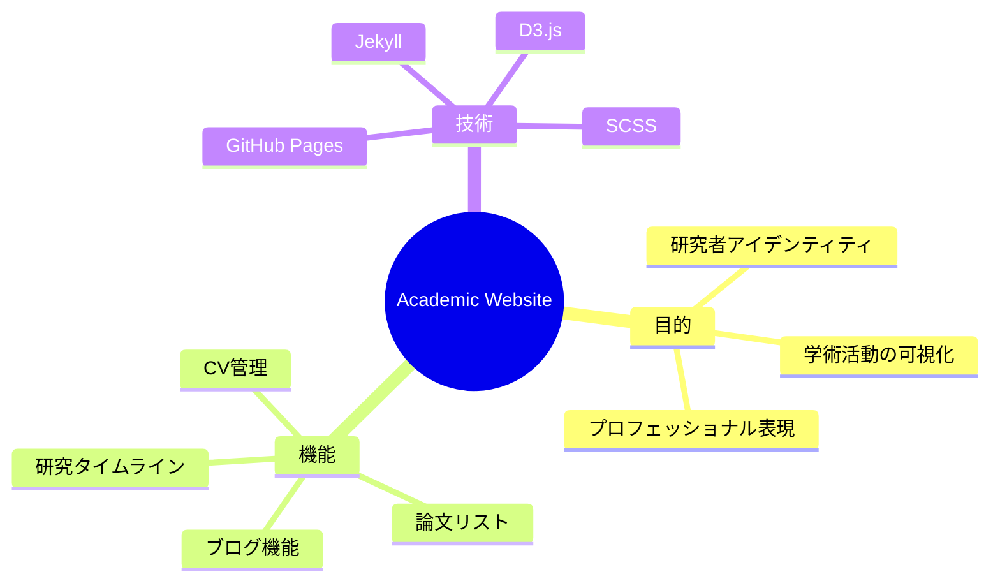
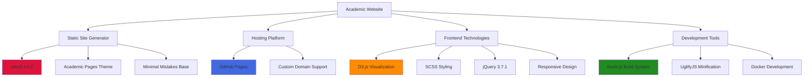
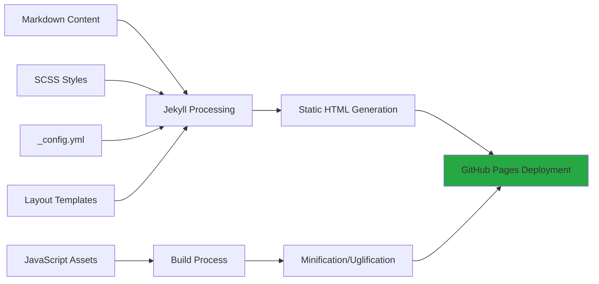
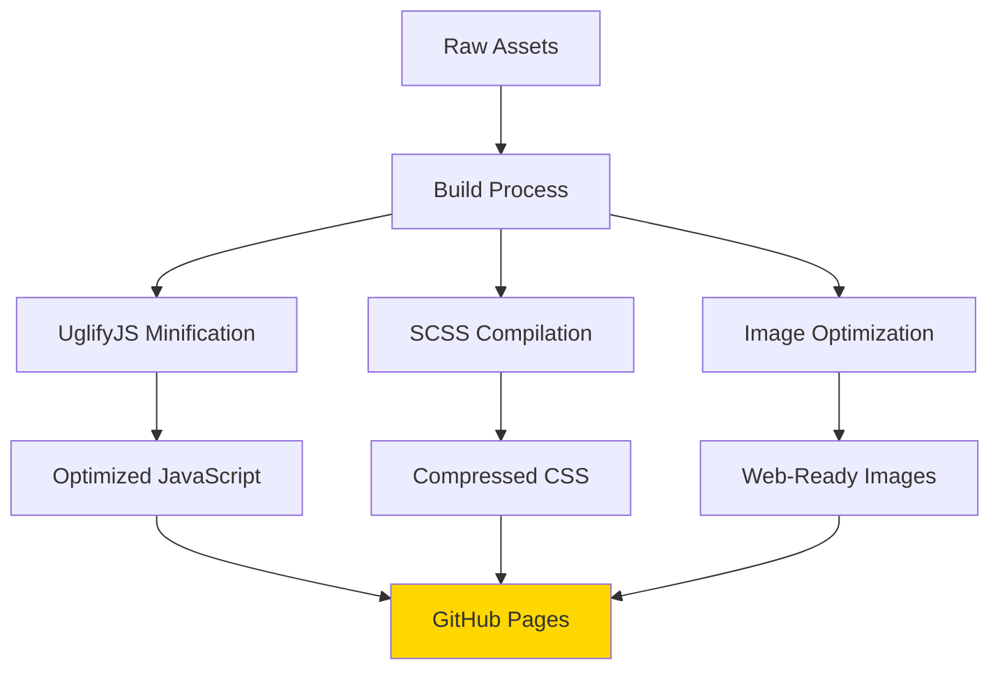
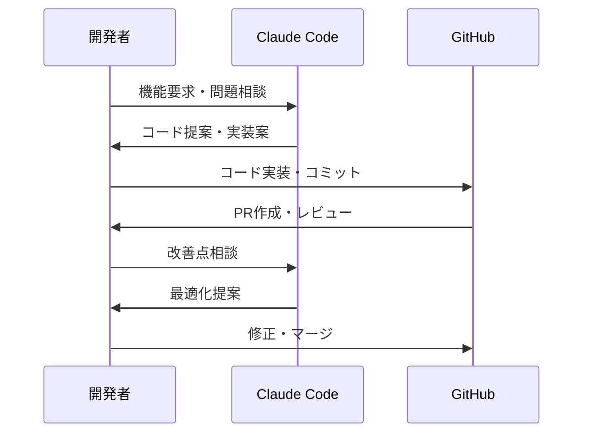
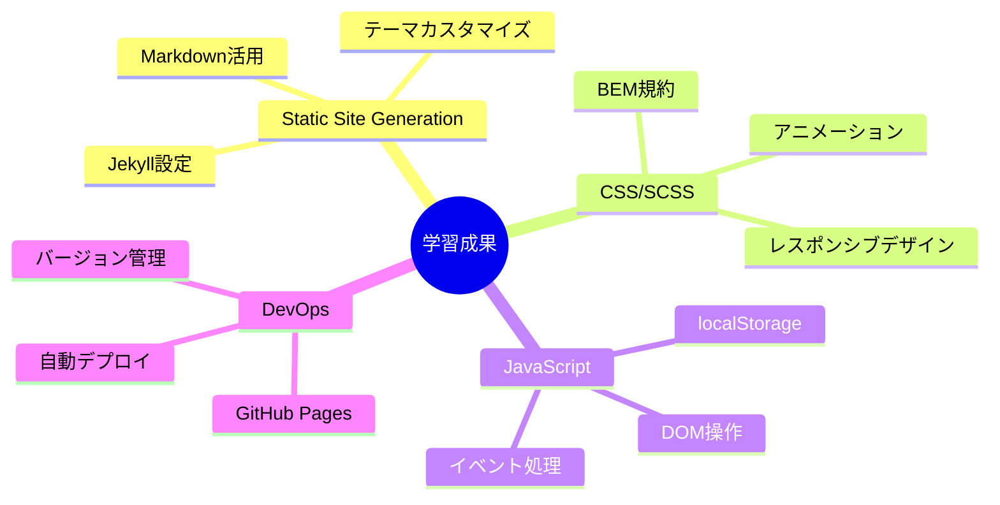
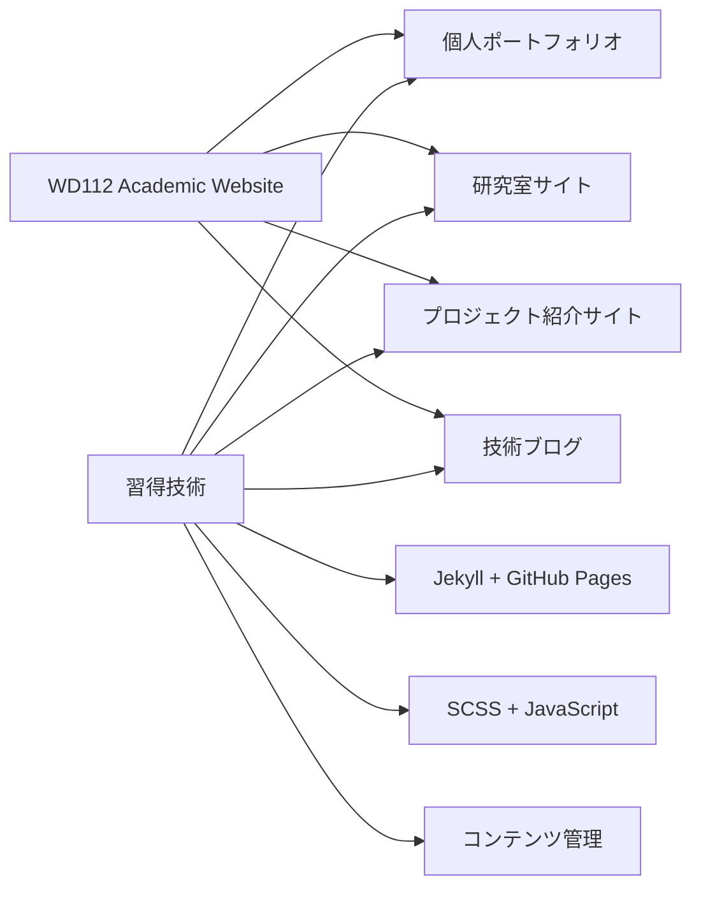

# WD112 Academic Website 開発学習資料
## Jekyll + GitHub Pages による学術サイト構築の実践記録

---

## プロジェクト概要

### 🎯 プロジェクトの目的
**研究者としての学術的アイデンティティを表現するプロフェッショナルなポートフォリオサイト**



### 📊 プロジェクト規模
- **総コミット数**: 707件
- **PR数**: 24件（すべてクローズ済み）
- **開発期間**: 継続中
- **ライセンス**: MIT

---

## 技術スタック分析

### Core Technologies



### Package.json分析

```json
{
  "name": "academic-pages",
  "version": "0.8.1.1",
  "dependencies": {
    "jquery": "^3.7.1",
    "fitvids": "^2.1.1",
    "jquery-smooth-scroll": "^2.2.0",
    "magnific-popup": "^1.2.0"
  },
  "devDependencies": {
    "onchange": "^7.1.0",
    "uglifyjs": "^3.17.4"
  }
}
```

---

## 開発プロセス分析

### PR履歴に基づく開発フェーズ

```mermaid
gantt
    title Academic Website 開発タイムライン
    dateFormat X
    axisFormat %s
    
    section 初期開発
    プロジェクト設定     :done, phase1, 0, 3
    コンテンツ追加       :done, phase2, 3, 2
    
    section 中期開発
    CV改善・整理        :done, phase3, 5, 3
    CSS・デザイン改善    :done, phase4, 8, 2
    
    section UI機能開発
    カラーピッカー実装   :done, phase5, 10, 4
    デバッグ・修正      :done, phase6, 14, 2
    
    section 最終調整
    BEM規約導入        :done, phase7, 16, 2
    コード清理          :done, phase8, 18, 2
```



### 主要PR分類

| フェーズ | PR番号 | 主要な変更内容 |
|---------|--------|---------------|
| **初期設定** | #1-5 | プロジェクト基盤、学術実績追加 |
| **コンテンツ拡充** | #6-11 | CV改善、言語能力追加、CSS最適化 |
| **UI機能開発** | #12-19 | カラーピッカー、localStorage、デバッグ |
| **最終調整** | #20-24 | BEM規約、ヒーローセクション、構文修正 |

---

## 技術的学習ポイント

### 1. Jekyll + GitHub Pages の活用



**学習成果:**
- 静的サイトジェネレーター（Jekyll）の実践的使用
- GitHub Pagesの自動デプロイメント設定
- Markdownベースのコンテンツ管理

### 2. フロントエンド開発技術

#### SCSS/CSS設計
```scss
// BEM (Block Element Modifier) 命名規則の採用例
.hero-section {
  &__title {
    font-size: 2.5rem;
    
    &--highlighted {
      color: var(--primary-color);
    }
  }
  
  &__animation {
    transition: transform 0.3s ease;
  }
}
```

#### JavaScript機能実装
```javascript
// カラーピッカー機能の実装例
const colorPicker = {
  init() {
    this.bindEvents();
    this.loadSavedColor();
  },
  
  saveToLocalStorage(color) {
    localStorage.setItem('selected-color', color);
  }
};
```

### 3. パフォーマンス最適化



---

## コード品質への取り組み

### BEM命名規則の導入

**Before:**
```css
.minimal-hero { }
.hero-title { }
.color-picker-container { }
```

**After:**
```css
.hero-section { }
.hero-section__title { }
.color-picker { }
.color-picker__container { }
```

### アクセシビリティ対応
```css
/* 動作を控えめにするユーザーへの配慮 */
@media (prefers-reduced-motion: reduce) {
  .hero-section__animation {
    animation: none;
    transition: none;
  }
}
```

---

## 開発ワークフロー

### Claude Code との協業プロセス



### 典型的な開発サイクル
1. **問題特定** → Claude Codeに相談
2. **実装案検討** → 技術的アドバイス取得
3. **コード実装** → PR作成
4. **テスト・デバッグ** → 問題解決
5. **マージ・デプロイ** → GitHub Pages自動更新

---

## 学習成果まとめ

### 🎓 習得した技術スキル



### 📈 プロジェクト管理スキル
- **段階的開発**: 機能単位での計画的実装
- **品質管理**: コードレビュー・リファクタリング
- **文書化**: 詳細なREADME・コメント
- **協業**: Claude Codeとの効果的な連携

### 🔧 実用的な開発パターン
- **テンプレートベース開発**: Academic Pagesの効果的なカスタマイズ
- **モジュラー設計**: 再利用可能なコンポーネント作成
- **プログレッシブエンハンスメント**: 基本機能から高度な機能へ

---

## 今後の応用可能性

### 類似プロジェクトへの適用


### 技術的発展の方向性
- **高度なJavaScript**: React/Vue.js への移行
- **バックエンド統合**: API連携・動的コンテンツ
- **SEO最適化**: メタデータ・構造化データ
- **パフォーマンス**: Core Web Vitals 最適化

---

## まとめ

WD112 Academic Websiteプロジェクトは、**現代的なWeb開発技術を学術分野に応用した優れた実践例**です。

### 🌟 プロジェクトの価値
1. **実用性**: 実際に使用される学術サイト
2. **技術性**: 最新のWeb開発手法を採用
3. **教育性**: 段階的な学習プロセスを記録
4. **拡張性**: 他プロジェクトへの応用可能

このプロジェクトから学んだ開発プロセス・技術スタック・品質管理手法は、今後のWeb開発プロジェクトの強固な基盤となるでしょう。

---

**リポジトリ**: https://github.com/NSada2025/WD112_academic-website  
**作成日**: 2025年7月30日  
**更新**: 継続中