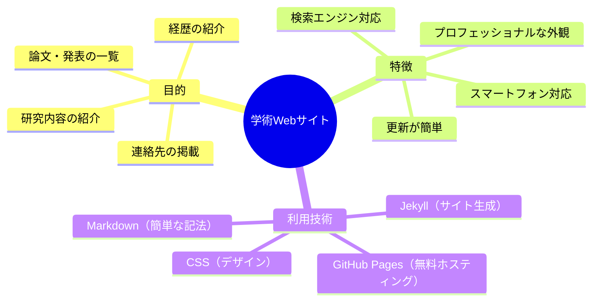
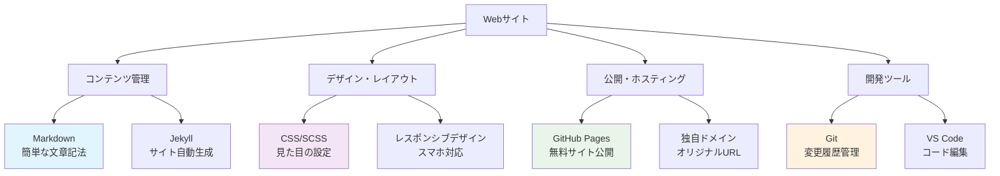
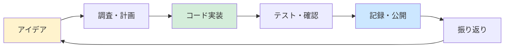
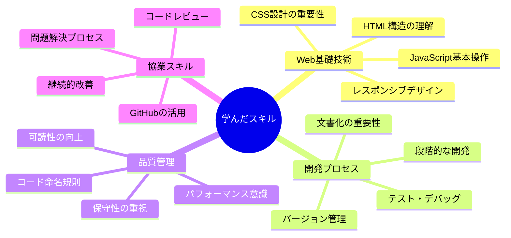
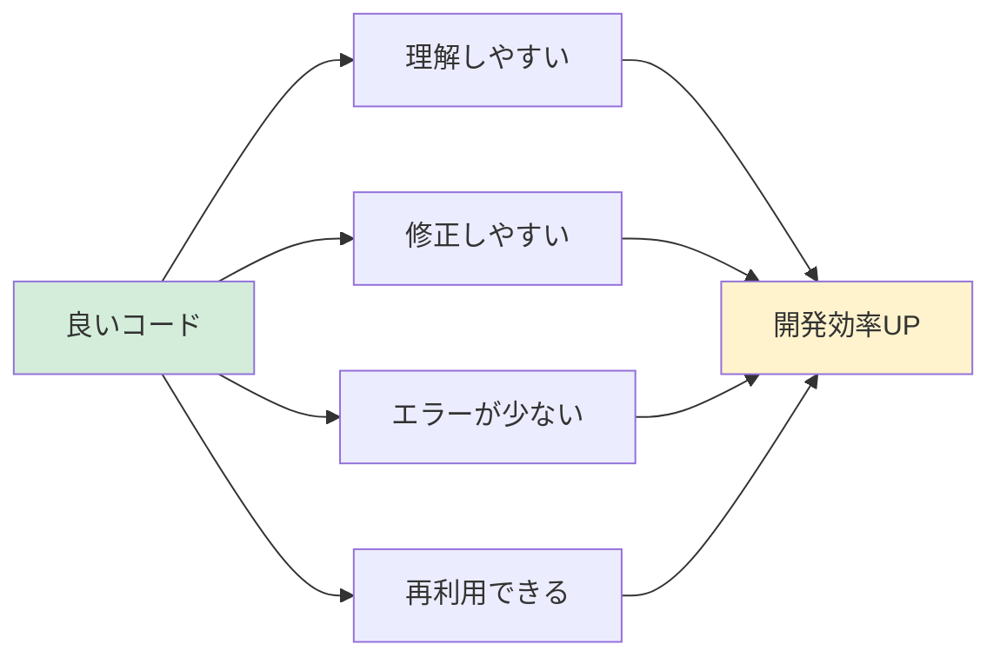
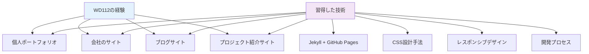

# 学術Webサイト開発の実践記録
## WD112プロジェクトから学ぶ現代的なWeb開発手法

---

## 目次

1. [はじめに](#はじめに)
2. [プロジェクト概要](#プロジェクト概要)
3. [使用した技術の基礎知識](#使用した技術の基礎知識)
4. [開発の流れ](#開発の流れ)
5. [実際のコード例](#実際のコード例)
6. [開発で得た学び](#開発で得た学び)
7. [今後に活かせること](#今後に活かせること)

---

## はじめに

この資料は、**学術研究者のためのWebサイト**を作成した実際の開発プロセスを、Web開発初心者にもわかりやすく解説したものです。

### この資料で学べること
- Webサイトを無料で作成・公開する方法
- プロフェッショナルなサイトの作り方
- 実際の開発における問題解決プロセス
- 現代的なWeb開発の基本的な流れ

### 読み方のコツ
- **太字の用語**: 重要な概念（詳細は用語解説で説明）
- **図表**: 複雑な関係を視覚的に表現
- **コード例**: 実際の開発で使用したもの

---

## プロジェクト概要

### 何を作ったのか

**学術研究者の個人Webサイト**を作成しました。具体的には：



### プロジェクトの規模感

| 項目 | 数値 | 説明 |
|------|------|------|
| **開発期間** | 継続中 | 段階的に機能追加 |
| **コード変更回数** | 707回 | 小さな改善を積み重ね |
| **機能追加回数** | 24回 | 主要な機能を順次追加 |
| **費用** | 無料 | GitHub Pagesを利用 |

---

## 使用した技術の基礎知識

### 主要な技術とその役割



### 技術用語解説

#### Jekyll（ジキル）
- **何？**: 文章からWebサイトを自動で作ってくれるツール
- **メリット**: HTMLを直接書かなくても、簡単な記法でサイトが作れる
- **例**: ブログ記事をMarkdownで書くと、自動的にHTMLページになる

#### GitHub Pages
- **何？**: GitHubが提供する無料のWebサイト公開サービス
- **メリット**: サーバー管理不要、独自ドメインも設定可能
- **制限**: 静的サイト（データベースなし）のみ

#### Markdown
- **何？**: 簡単にHTMLを書くための記法
- **例**: `# 見出し`、`**太字**`、`- リスト`
- **メリット**: HTMLより簡単、読みやすい

#### SCSS
- **何？**: CSSをより便利に書けるようにした記法
- **メリット**: 変数使用、ネスト（入れ子）記法、関数機能
- **例**: 色を変数で管理、共通スタイルを再利用

---

## 開発の流れ

### 開発タイムライン

実際の開発は以下のような段階を経て進められました：

```mermaid
gantt
    title 学術Webサイト開発の流れ
    dateFormat X
    axisFormat %s
    
    section 1. 基盤作り
    プロジェクト設定     :done, phase1, 0, 2
    基本テンプレート導入 :done, phase2, 2, 2
    
    section 2. コンテンツ追加
    学歴・経歴の追加     :done, phase3, 4, 3
    研究内容の整理       :done, phase4, 7, 2
    
    section 3. デザイン改善
    見た目の調整         :done, phase5, 9, 3
    スマホ対応          :done, phase6, 12, 2
    
    section 4. 機能拡張
    カラーテーマ機能     :done, phase7, 14, 3
    アニメーション追加   :done, phase8, 17, 2
    
    section 5. 品質向上
    コードの整理         :done, phase9, 19, 2
    最終調整            :done, phase10, 21, 2
```



### 典型的な開発サイクル



### 主要な機能追加の記録

| 段階 | 追加した機能 | なぜ必要だったか | 学んだこと |
|------|-------------|----------------|-----------|
| **1. 基盤** | Jekyll設定、基本レイアウト | サイトの土台作り | プロジェクト構造の重要性 |
| **2. コンテンツ** | CV、研究経歴 | 情報を整理して掲載 | 情報設計の重要性 |
| **3. デザイン** | CSS改善、レスポンシブ対応 | 見た目をプロフェッショナルに | ユーザー体験の重要性 |
| **4. 機能** | カラーピッカー、アニメーション | サイトに個性を付加 | JavaScriptの基本 |
| **5. 品質** | コード整理、命名規則統一 | 保守性の向上 | 良いコードの書き方 |

---

## 実際のコード例

### Markdownでのコンテンツ作成

**Before（難しいHTML）:**
```html
<div class="biography-section">
  <h2 class="section-title">研究経歴</h2>
  <ul class="experience-list">
    <li class="experience-item">
      <strong>2023年</strong>: 〇〇大学大学院入学
    </li>
  </ul>
</div>
```

**After（簡単なMarkdown）:**
```markdown
## 研究経歴

- **2023年**: 〇〇大学大学院入学
- **2022年**: △△研究所でインターンシップ
```

### CSSでのデザイン改善

#### コード命名規則の改善（BEM手法の導入）

**Before（わかりにくい命名）:**
```css
.hero { }
.title { }
.button { }
```

**After（明確な命名）:**
```css
/* Block（大きなまとまり） */
.hero-section { }

/* Element（要素） */
.hero-section__title { }
.hero-section__button { }

/* Modifier（バリエーション） */
.hero-section__button--primary { }
```

### JavaScript機能の追加例

```javascript
// カラーテーマ切り替え機能
const colorPicker = {
  // 初期化
  init() {
    this.loadSavedColor();    // 保存された色を読み込み
    this.bindEvents();        // ボタンクリックなどのイベント設定
  },
  
  // 選択した色を保存
  saveColor(color) {
    localStorage.setItem('selected-color', color);
  },
  
  // 保存された色を読み込み
  loadSavedColor() {
    const savedColor = localStorage.getItem('selected-color');
    if (savedColor) {
      this.applyColor(savedColor);
    }
  }
};
```

---

## 開発で得た学び

### 技術的な学び



### 重要な発見

#### 1. **段階的開発の重要性**
- 一度にすべてを作ろうとしない
- 小さな機能から始めて、徐々に拡張
- 各段階で動作確認を行う

#### 2. **ユーザー視点の重要性**
- 作る側の都合ではなく、見る人の立場で考える
- スマートフォンでの見やすさ
- 情報の見つけやすさ

#### 3. **コード品質の重要性**


### 実践的なテクニック

#### CSS設計のコツ
```css
/* 1. 変数を使って統一感を出す */
:root {
  --primary-color: #007bff;
  --text-color: #333;
  --spacing-unit: 1rem;
}

/* 2. 再利用可能なクラスを作る */
.btn {
  padding: var(--spacing-unit);
  border-radius: 4px;
  border: none;
  cursor: pointer;
}

.btn--primary {
  background-color: var(--primary-color);
  color: white;
}
```

#### レスポンシブデザインの基本
```css
/* モバイルファースト（小さい画面から設計） */
.container {
  width: 100%;
  padding: 1rem;
}

/* タブレット以上 */
@media (min-width: 768px) {
  .container {
    max-width: 750px;
    margin: 0 auto;
  }
}

/* デスクトップ */
@media (min-width: 1024px) {
  .container {
    max-width: 1200px;
  }
}
```

---

## 今後に活かせること

### このプロジェクトから得られる応用



### スキルアップの道筋

#### 初級から中級へ
1. **より高度なCSS**: アニメーション、Grid Layout
2. **JavaScript強化**: DOM操作、API連携
3. **パフォーマンス**: 読み込み速度の最適化
4. **SEO**: 検索エンジン対策

#### 中級から上級へ
1. **フレームワーク**: React、Vue.js
2. **バックエンド**: Node.js、データベース
3. **DevOps**: 自動デプロイ、監視
4. **チーム開発**: コードレビュー、プロジェクト管理

### 実際の活用例

#### 1. 研究室のWebサイト
```markdown
- 研究メンバーの紹介
- 研究成果の発表
- セミナー・イベント情報
- 学生募集情報
```

#### 2. 個人ブログ
```markdown
- 技術記事の投稿
- 学習記録の公開
- プロジェクトの紹介
- キャリア記録
```

#### 3. プロダクト紹介サイト
```markdown
- サービスの特徴説明
- 料金・プラン案内
- お客様の声
- お問い合わせフォーム
```

---

## まとめ

### このプロジェクトの価値

WD112 Academic Websiteプロジェクトは、**現代的なWeb開発の基本を実践的に学べる優れた教材**でした。

#### 特に価値があったポイント

1. **実用性**: 実際に使用される本格的なサイト
2. **段階性**: 基礎から応用まで順序立てて学習
3. **現代性**: 最新の開発手法・ツールを使用
4. **記録性**: 開発プロセスがすべて記録されている

#### 身についたスキル

- **技術スキル**: HTML/CSS/JavaScript、Jekyll、Git
- **設計スキル**: レスポンシブデザイン、CSS設計
- **開発スキル**: 段階的開発、デバッグ、最適化
- **協業スキル**: バージョン管理、文書化、問題解決

#### 今後への活用

この経験は、**Web開発の基盤として今後あらゆるプロジェクトで活用できる**貴重な財産となりました。

---

## 参考リンク

- **プロジェクトURL**: https://github.com/NSada2025/WD112_academic-website
- **Jekyll公式**: https://jekyllrb.com/
- **GitHub Pages**: https://pages.github.com/
- **Markdown記法**: https://docs.github.com/ja/get-started/writing-on-github

---

**作成日**: 2025年7月30日  
**最終更新**: 2025年7月30日  
**作成者**: NSada2025 & Claude Code